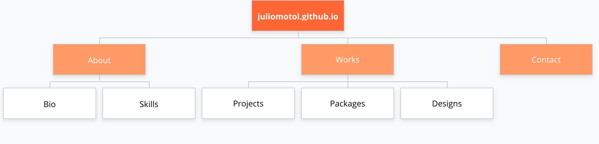

# juliomotol.github.io

## Overview
juliomotol.github.io is a portfolio website to showcase personal projects powered by [Vue.js](https://www.github.com/vuejs/vue). It is aimed to target prospective clients, customers and employers.

## Goals
- Create an immersive website with current UI/UX trends.
- Reinvent myself.

## Project Phases
### Phase 1: Design & Planning
- [x] Website Specification
- [ ] Brand New Branding 
- [ ] Wireframes
### Phase 2: Website Development
- [x] Project Setup
- [ ] Development
- [ ] Feedbacks and Adjustments
### Phase 3: Public Release

## Sitemap

<!-- 
## Design
### Branding
### Wireframe 
-->
## Features & Functionality
### General Features:
- Dark mode theme

### About
- Bio
- Skills
### Works
- Preview Project
### Contact
- Contact Informations
- Social accounts
- Send inquiry via email

